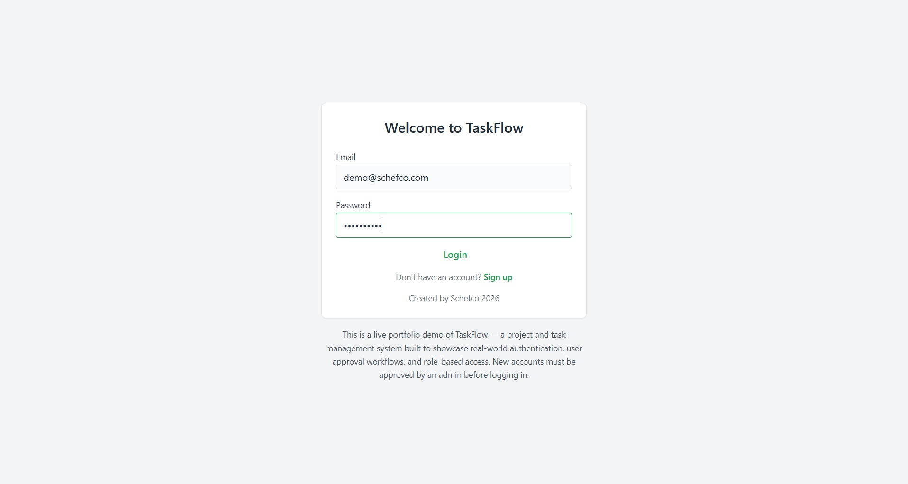
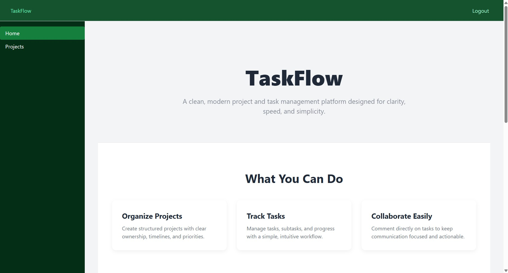
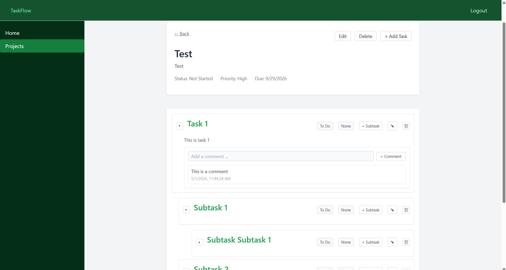
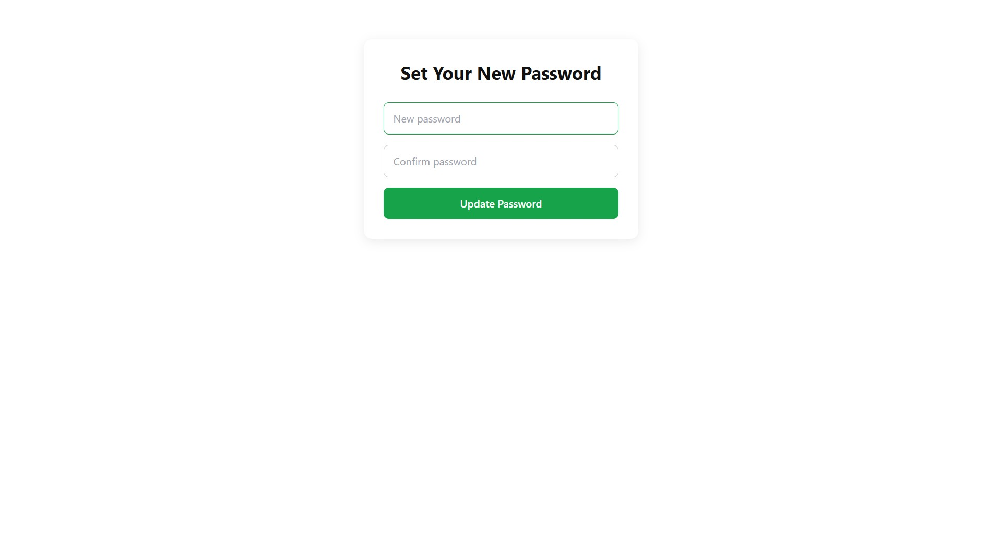

# TaskFlow

TaskFlow is a full-stack workflow and task management system designed for structured task tracking, role-based access control, and backend-driven workflows.

It is built using ASP.NET Core, React, and PostgreSQL, with a focus on clean API design, data modeling, and responsive user experience.

---

## Features

- User authentication with JWT-based session handling  
- Role-based access control (Owner and User roles)  
- Project creation and management  
- Task tracking with subtasks and progress indicators  
- User management and approval workflow (Owner-only features)  
- First-time password reset flow  
- API-driven frontend architecture using Axios  
- Responsive UI built with React and modular components  

---

## Tech Stack

- React 18 + TypeScript  
- ASP.NET Core Web API  
- PostgreSQL  
- Zustand (state management)  
- React Router  
- Axios  
- Vite  

---

## Screenshots

### Login


---

### Splash / Landing Page


---

### Projects Dashboard


---

### Task / FTP Management View


---

## System Overview

TaskFlow is structured as a full-stack system with a clear separation between frontend and backend services:

- React frontend client for UI and state management  
- ASP.NET Core REST API backend for business logic and authentication  
- PostgreSQL database for relational data modeling  
- JWT-based authentication with role-aware routing and access control  

The system is designed around workflow-driven task management with structured relationships between users, projects, and tasks.

---

## Running the Project

### Install dependencies
```bash
npm install
```

### Start development server
```bash
npm run dev
```

### Build for production
```bash
npm run build
```

### Preview production build
```bash
npm run preview
```

---

## Environment Variables

### Create a .env file in the project root:
```env
VITE_API_URL=https://your-backend-url/api
```

---

## Authentication Flow
- Users authenticate with email and password
- JWT token is issued and stored client-side
- Role-based routing restricts access to protected pages
- First-time login triggers password reset flow if required


---

## License

This project is available for learning, review, and portfolio demonstration purposes.